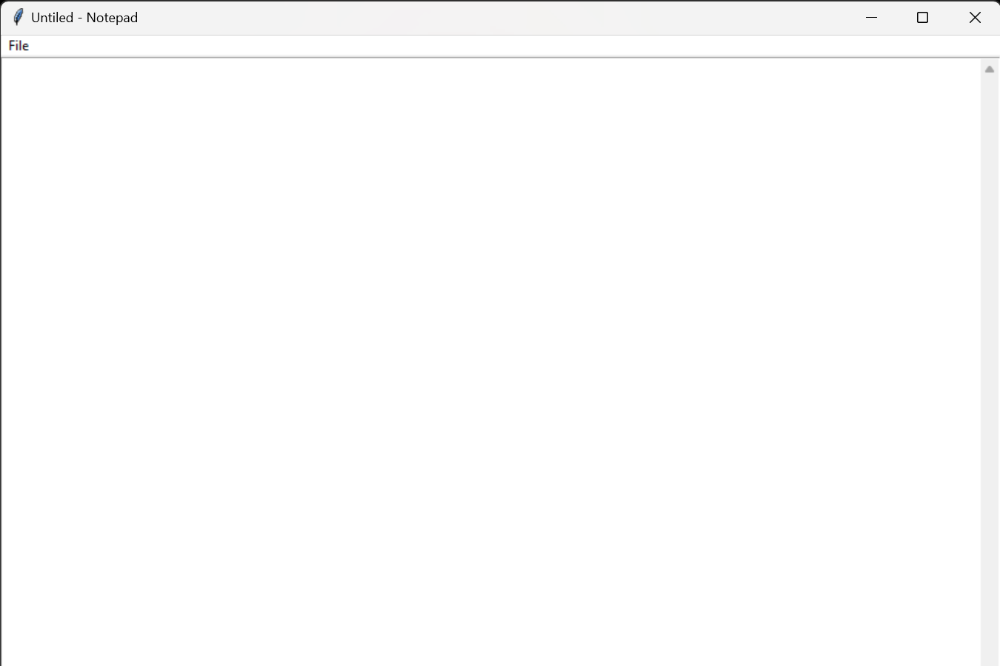

# Notepad

A simple Notepad application for taking and managing notes. Built using Python, this application provides a user-friendly interface for creating, editing, viewing, and deleting notes.

## Features

- Create, view, edit, and delete notes
- Rich text editor for formatting notes
- Responsive design for mobile and desktop

## Technologies Used

- **Programming**: Python

## Screenshots

To provide a better understanding of the Recipe Book application, here is a screenshot:

##Main Interface

Feel free to customize this template according to your project's specific needs and details!

For any inquiries, please contact:

Name: Gauranshi Varshney
Email: gauranshivarshney@gmail.com
